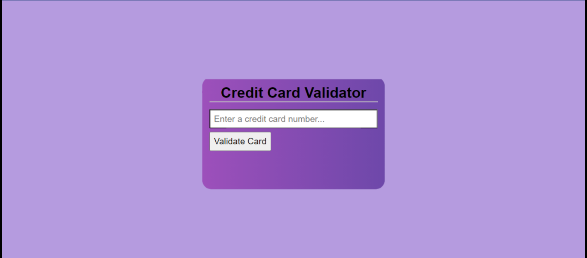

# Credit Card Checker

## About

The web app is a credit card checker based on Luhn's algorithm. It is a solution to the credit card checker challenge on the codecademy.com JavaScript course.

The solution to the challenge can be found in the main.js file while the code used in the app can be found in the app.js file.

You can test the app using your credit card or generating fake credit cards.

## Tools used

- **Sublime text 3**
- **HTML**
- **CSS**
- **JavaScript**
- **Git and Github**

## Deployment

The web app was deployed using  **[Netlify](netlify.com)** and can be accessed on **https://jesulonimiicardvalidator.netlify.app/**

## Contributing

Feel free to fork and clone the repo. I'll really appreciate help in the design aspect. 
